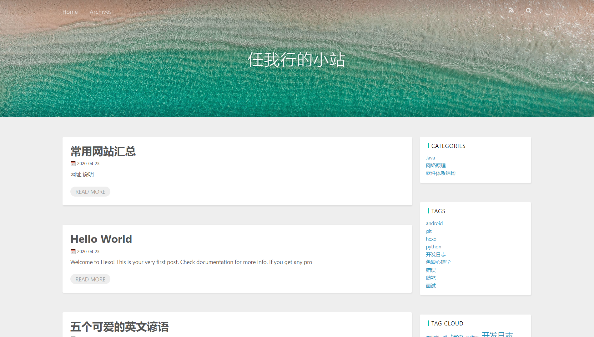

 

 
  一款非常简单的，基于原始主题landscape魔改的，Hexo主题

## 📌TODO
TODO  | 完成情况
-- | -- 
回顶 | ❌
🍰可折叠的题目块 | ❌
可自定义颜色 | ✅
全局搜索 | ❌
网站seo优化（虽然现在还不懂是什么。。） | ❌
rss(同上。。) | ❌
评论系统（更倾向于gitalk） | ❌
点赞系统（长远计划） | ❌
首页展示的文章自动截断 | ✅
可选择的代码块风格 | ❌

## 📝更新日志
> 🍰表示加入了什么功能，🍖表示修复或梅花了什么东西，（随便选的符号(￣▽￣)"
### 2020/4/23

1. 🍰可自定义首页顶部的图片
2. 🍰可以自定义首页文字
3. 🍰可自定义颜色（待修改）

### 2020/4/24

1. 🍖首页展示的文章可自动截断
2. 🍖美化了widget的样式
