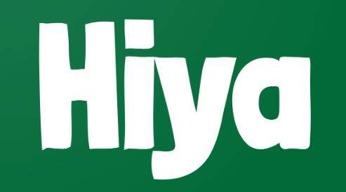
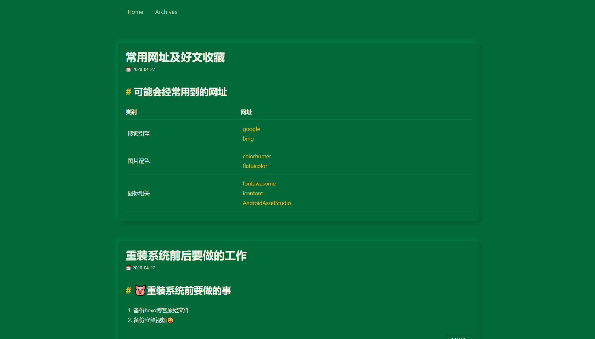
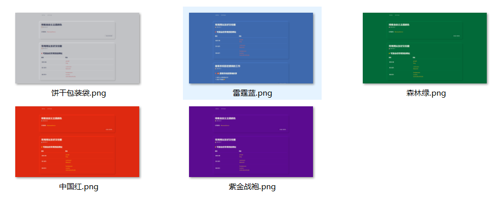

# 不再维护🏃‍

<p align="center">

 <br>
一款极简的，拟态风格的，基于landscape改造的Hexo主题
</p>



## 🚧 已停止维护 🤣

## 🍚Demo
- 国内访问：[任我行的小站gitee](https://fushaolei.gitee.io/)
- 国外访问：[任我行的小站github](https://fushaolei.github.io/)

## 💪特点

### 🎨支持自定义颜色


更多请戳这里👉[自定义主题颜色(持续更新中)](https://github.com/FuShaoLei/hexo-theme-hiya/issues/1)

### 😋Valine评论系统
配置简单，游客可评论

### 😜更多功能开发中。。

## 🍔安装
```
git clone https://github.com/FuShaoLei/hexo-theme-hiya.git themes/hiya
```
然后修改你根目录的`_config.yml`👇
```
+ theme: hiya
```
就大功告成了😘
 
## 🎏 _config.yml

```yml
# Header
menu:
  Home: /
  Archives: /archives

# 自定义颜色
color:
  bg: "#2E343B"          #背景颜色
  bg_dark: "#272c32"     #较黑的背景色
  bg_light: "#353c44"    #较亮的背景色
  # 以上三个颜色均可在 https://neumorphism.io/#55b9f3 获取，背景色的自己定的，在输入框输入自己定的颜色后，box-shadow 出现的第一行就是较暗的背景色，第二行的就是较亮的背景色
  normal_text: "#F9FBFC" #普通文字的颜色
  highlight: "#A22323"   # 高亮

# 网站个性化
icon_img: ../img/icon.png  #标签页图标
site_author: 任我行         #网站作者
site_name: 任我行的小站     #网站名字

# Valine 评论系统
valine:
  open: true # true | false 是否打开
  appid: HBismw2vU6hg56PslAF2APW1-gzGzoHsz  #Leancloud应用的AppID
  appkey: k41e2BJYdNbojyHuMnKT5LBK  #Leancloud应用的AppKey
  verify: false #验证码
  notify: true #评论回复提醒
  avatar: robohash #评论列表头像样式：''/mm/identicon/monsterid/wavatar/retro/hide
  #头像类型可见： https://valine.js.org/avatar.html
  placeholder: 留下你来过的痕迹~ #评论框占位符

```

## 👋联系我

如果你有什么好的意见或建议的话，欢迎你和我交流！也欢迎提issue，或者pull request

- 邮箱：1563250958@qq.com
- QQ： 1563250958

## 🏊‍♂️其他
- [更新日志](https://github.com/FuShaoLei/hexo-theme-hiya/issues/3)
- [TODO](https://github.com/FuShaoLei/hexo-theme-hiya/issues/2)

