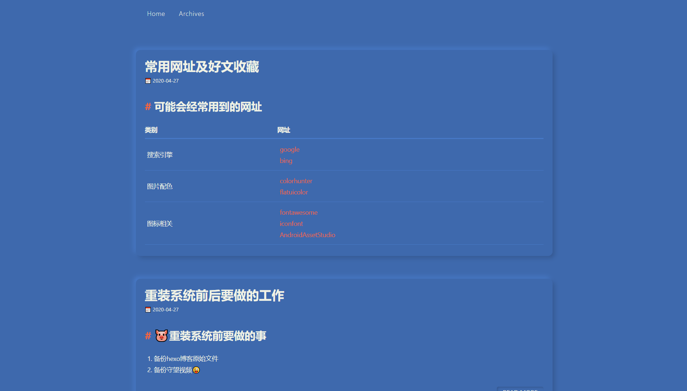

<p align="center">
一款极简的，拟态风格的，基于landscape改造的Hexo主题
</p>



## 🍚Demo
- 国内访问：[任我行的小站gitee](https://fushaolei.gitee.io/)
- 国外访问：[任我行的小站github](https://fushaolei.github.io/)

## 🎨支持自定义颜色


更多请戳这里👉[博客自定义主题颜色(持续更新中~)](https://fushaolei.github.io/2020/04/30/%E5%8D%9A%E5%AE%A2%E8%87%AA%E5%AE%9A%E4%B9%89%E4%B8%BB%E9%A2%98%E9%A2%9C%E8%89%B2/)


## 🍔安装
```
git clone https://github.com/FuShaoLei/hexo-theme-hiya.git themes/hiya
```
然后修改你根目录的`_config.yml`👇
```
theme: hiya
```
就大功告成了😘

## 📌TODO
TODO  | 完成情况
-- | -- 
回顶 | ❌
🍰可折叠的题目块 | ✅
可自定义颜色 | ✅
全局搜索 | ❌
网站seo优化（虽然现在还不懂是什么。。） | ❌
rss(同上。。) | ❌
评论系统（更倾向于gitalk） | ❌
点赞系统（长远计划） | ❌
首页展示的文章自动截断 | ✅（已废弃，这样字太丑了。。）
可选择的代码块风格 | ❌
可复制的代码块 | ❌
加入不蒜子统计 | ❌
 

## 📝更新日志
> 🍰表示加入了什么功能，🍖表示修复或美化了什么东西，（随便选的符号(￣▽￣)"
### 2020/4/23

1. 🍰可自定义首页顶部的图片
2. 🍰可以自定义首页文字
3. 🍰可自定义颜色（待修改）

### 2020/4/24

1. 🍖首页展示的文章可自动截断
2. 🍖美化了widget的样式

### 2020/4/27
1. 🍖美化了文章标题的样式
2. 🍰加入了可折叠区域
3. 🍖美化了分割线的样式

### 2020/4/29
1. 🎉大改了全部样式，换成了淡雅 拟态风格的样式🎉
